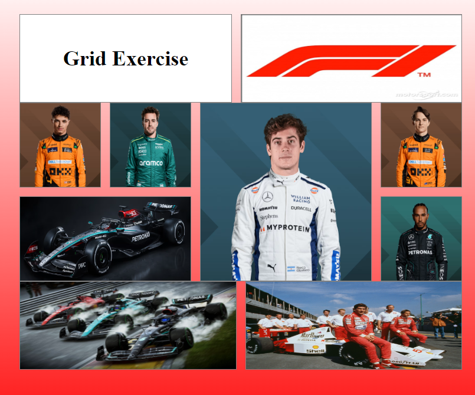

# CSS-Grid-Exercise

*Inside this project you can find a grid with some pictures about the F1*

---
## Languages ​​used to develop the project

---

### Purpose
The purpose of this project was to create a grid to improve another type of image organization display

#### Grid ScreenShot

